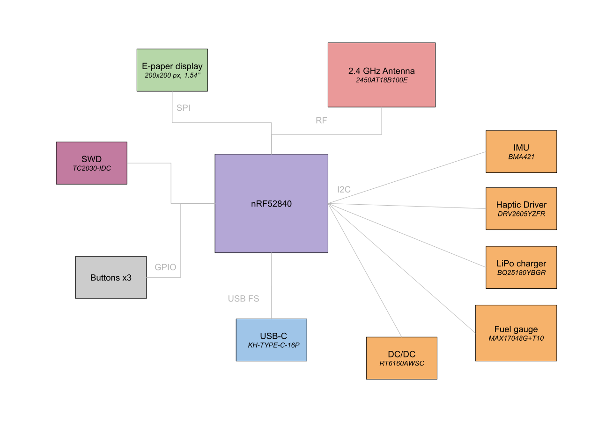

# InkTime Smartwatch Project

InkTime is an open source startup focused on developing an affordable and customizable smartwatch centered around the nRF52840 SoC and e-ink display technology. This repository contains the full hardware design, including the schematic, PCB layout, and mechanical integration files required for mass production.

## Component Block Diagram

## Bill of Materials

| Device | Value | Qty | Parts | Product Link | Datasheet Link |
| --- | --- | --: | --- | --- | --- |
| NORDIC_NRF_4_NRF52840_QF | nRF52840-QIAA | 1 | U1 | [JLCPCB](https://jlcpcb.com/partdetail/NordicSemicon-NRF52840_QIAAR/C190794) | [Datasheet](https://infocenter.nordicsemi.com/pdf/nRF52840_PS_v1.9.pdf) |
| RT6160AWSC | RT6160AWSC | 1 | IC9 | [JLCPCB](https://jlcpcb.com/partdetail/RichtekTech-RT6160AWSC/C7065276) | [Datasheet](https://www.mouser.com/datasheet/2/1458/DS6160A_03-3104604.pdf) |
| BQ25180YBGR | BQ25180YBGR | 1 | IC1 | [JLCPCB](https://jlcpcb.com/partdetail/TexasInstruments-BQ25180YBGR/C3682423) | [Datasheet](https://www.ti.com/lit/ds/symlink/bq25180.pdf) |
| ESP32_C6_LIBRARY_MAX17048G+T10 | MAX17048G+T10 | 1 | U3 | [JLCPCB](https://jlcpcb.com/partdetail/MaximIntegrated-MAX17048GT10/C2682616) | [Datasheet](https://www.analog.com/media/en/technical-documentation/data-sheets/MAX17048-MAX17049.pdf) |
| DRV2605YZFR | DRV2605YZFR | 1 | IC2 | [JLCPCB](https://jlcpcb.com/partdetail/TexasInstruments-DRV2605YZFR/C81079) | [Datasheet](https://www.ti.com/lit/ds/symlink/drv2605.pdf) |
| BMA421 | BMA421 | 1 | IC3 | [JLCPCB](https://jlcpcb.com/partdetail/BoschSensortec-BMA421/C5242966) | [Datasheet](https://files.pine64.org/doc/datasheet/pinetime/BST-BMA421-FL000.pdf) |
| DMG2305UX-7 | DMG2305UX-7 | 1 | Q2 | [JLCPCB](https://jlcpcb.com/partdetail/HXYMOSFET-DMG2305UX7/C5261054) | [Datasheet](https://www.diodes.com/assets/Datasheets/DMG2305UX.pdf) |
| ESP32_C6_LIBRARY_6_SI1308EDL-T1-GE3 | SI1308EDL-T1-GE3 | 1 | Q3 | [JLCPCB](https://jlcpcb.com/partdetail/TECHPUBLIC-SI1308EDL/C7603347) | [Datasheet](https://www.vishay.com/docs/63399/si1308edl.pdf) |
| USBLC6-2SC6Y | USBLC6-2SC6Y | 1 | D3 | [JLCPCB](https://jlcpcb.com/partdetail/TECHPUBLIC-USBLC62SC6Y/C5310974) | [Datasheet](https://wmsc.lcsc.com/wmsc/upload/file/pdf/v2/lcsc/2401261525_TECH-PUBLIC-USBLC6-2SC6Y_C5310974.pdf) |
| MBR0530 | MBR0530 | 3 | D2, D4, D5 | [JLCPCB](https://jlcpcb.com/partdetail/4324765-MBR0530_F20000HF/C3757235) | [Datasheet](https://wmsc.lcsc.com/wmsc/upload/file/pdf/v2/lcsc/2205311800_Yangzhou-Yangjie-Electronic-Technology-MBR0530-F2-0000HF_C3757235.pdf) |
| KH-TYPE-C-16P_KH-TYPE-C-16P | KH-TYPE-C-16P | 1 | J4 | [JLCPCB](https://jlcpcb.com/partdetail/KH-TYPE-C-16P/C709357) | [Datasheet](https://wmsc.lcsc.com/wmsc/upload/file/pdf/v2/lcsc/2204251630_SHENZHEN-KINGHELM-Elec-KH-TYPE-C-16P_C709357.pdf) |
| 5034802400 | 503480-2400 | 1 | J1 | [JLCPCB](https://jlcpcb.com/partdetail/MOLEX-5034802400/C122434) | [Datasheet](https://www.mouser.com/datasheet/2/276/2/5034802400_FFC_FPC_CONNECTORS-1112921.pdf) |
| EVP-AKE31A | EVP-AKE31A | 3 | SW_DN, SW_ENT, SW_UP | [JLCPCB](https://jlcpcb.com/partdetail/PANASONIC-EVPAKE31A/C569760) | [Datasheet](https://www.lcsc.com/datasheet/C569760.pdf) |
| 2450AT18B100E_2450AT18B100E | 2450AT18B100E | 1 | ANT1 | [JLCPCB](https://jlcpcb.com/partdetail/JohansonTechnology-2450AT18B100/C2836414) | [Datasheet](https://www.johansontechnology.com/datasheets/antennas/2450AT18B100.pdf) |
| NX2016SA-32MHZ-STD-CZS-5 | 32 MHz | 1 | X1 | [JLCPCB](https://jlcpcb.com/partdetail/NDK-NX2016SA_32MHZ_STD_CZS5/C843260) | [Datasheet](https://www.lcsc.com/datasheet/C843260.pdf) |
| NORDIC_NRF_1_XTAL_32KHZ | 32.768 kHz | 1 | X2 | [JLCPCB](https://jlcpcb.com/partdetail/NDK-NX3215SA_32_768K_STD_MUA9/C519280) | [Datasheet](https://www.ndk.com/images/products/crystal/resonator/NX3215SA_e.pdf) |
| MLP2016SR47MT0S1_FTC252012SR47MBCA | FTC252012SR47MBCA | 1 | L7 | [JLCPCB](https://jlcpcb.com/partdetail/6763488-FTC252012SR47MBCA/C5832368) | [Datasheet](https://wmsc.lcsc.com/wmsc/upload/file/pdf/v2/lcsc/2311271530_TDK-FTC252012SR47MBCA_C5832368.pdf) |
| VHF060303H3N9ST | 3.9 nH | 1 | L1 | [JLCPCB](https://jlcpcb.com/partdetail/153834-VHF060303H3N9ST/C142503) | [Datasheet](https://www.lcsc.com/datasheet/C142503.pdf) |
| MLK0603L15NJT000 | 15 nH | 1 | L3 | [JLCPCB](https://jlcpcb.com/partdetail/TDK-MLK0603L15NJT000/C6990407) | [Datasheet](https://www.lcsc.com/datasheet/C6990407.pdf) |
| RNCF0201DTC3K30 | 3.3 kΩ | 2 | R17, R18 | [JLCPCB](https://jlcpcb.com/partdetail/SEI_Stackpole_Elec-RNCF0201DTC3K30/C2487997) | [Datasheet](https://www.lcsc.com/datasheet/C2487997.pdf) |
| RC0201FR-075K1L | 5.1 kΩ | 2 | R1_USB, R2_USB | [JLCPCB](https://jlcpcb.com/partdetail/YAGEO-RC0201FR075K1L/C274341) | [Datasheet](https://www.lcsc.com/datasheet/C274341.pdf) |
| RC0201FR-1310KL | 10 kΩ | 6 | R2_EP_DR, R5, R7, R8, R9, R_PWR_EPD | [JLCPCB](https://jlcpcb.com/partdetail/YAGEO-RC0201FR1310KL/C6373588) | [Datasheet](https://www.lcsc.com/datasheet/C6373588.pdf) |
| 0201WMF220KTCE | 2.2 Ω | 1 | R_TYPE_SEL | [JLCPCB](https://jlcpcb.com/partdetail/244650-0201WMF220KTCE/C247442) | [Datasheet](https://www.lcsc.com/datasheet/C247442.pdf) |
| 0201WMJ0000TCE | 0 Ω | 3 | R2, R3, R4 | [JLCPCB](https://jlcpcb.com/partdetail/25793-0201WMJ0000TCE/C25050) | [Datasheet](https://www.lcsc.com/datasheet/C25050.pdf) |
| MA0201XF821K250 | 820 pF | 1 | C9 | [JLCPCB](https://jlcpcb.com/partdetail/Meritek-MA0201XF821K250/C3842403) | [Datasheet](https://www.lcsc.com/datasheet/C3842403.pdf) |
| GRM0335C1E1R0CA01J | 1 pF | 2 | C3, C4 | [JLCPCB](https://jlcpcb.com/partdetail/2274979-GRM0335C1E1R0CA01J/C2182912) | [Datasheet](https://www.lcsc.com/datasheet/C2182912.pdf) |
| 0201N120J250CT | 12 pF | 4 | C1, C2, C17, C18 | [JLCPCB](https://jlcpcb.com/partdetail/Walsin_TechCorp-0201N120J250CT/C424835) | [Datasheet](https://www.lcsc.com/datasheet/C424835.pdf) |
| 0201N101F160CT | 100 pF | 1 | C11 | [JLCPCB](https://jlcpcb.com/partdetail/Walsin_TechCorp-0201N101F160CT/C3847857) | [Datasheet](https://www.lcsc.com/datasheet/C3847857.pdf) |
| C0201X5R473K160NTA | 47 nF | 1 | C16 | [JLCPCB](https://jlcpcb.com/partdetail/126083-C0201X5R473K160NTA/C124806) | [Datasheet](https://www.lcsc.com/datasheet/C124806.pdf) |
| AC0201KRX6S6BB104 | 100 nF | 9 | C5, C7, C8, C12, C19, C23, C27, C34, C42 | [JLCPCB](https://jlcpcb.com/partdetail/YAGEO-AC0201KRX6S6BB104/C3855913) | [Datasheet](https://www.lcsc.com/datasheet/C3855913.pdf) |
| CL05A105KP5NNNC | 1 µF | 1 | C15 | [JLCPCB](https://jlcpcb.com/partdetail/C14445) | [Datasheet](https://www.lcsc.com/datasheet/C14445.pdf) |
| GRM155R61H105KE05D | 1 µF / 50V | 9 | EPD_C1, EPD_C2, EPD_C6, EPD_C7, EPD_C8, EPD_C9, EPD_C10, EPD_C11, EPD_C12 | [JLCPCB](https://jlcpcb.com/partdetail/1609005-GRM155R61H105KE05D/C1518208) | [Datasheet](https://www.lcsc.com/datasheet/C1518208.pdf) |
| GRM155R61A475KEAAD | 4.7 µF | 5 | C6, C14, C20, C21, C43 | [JLCPCB](https://jlcpcb.com/partdetail/MurataElectronics-GRM155R61A475KEAAD/C77004) | [Datasheet](https://www.lcsc.com/datasheet/C77004.pdf) |
| C0402X5R475M250NT | 4.7 µF / 25V | 1 | C2-EP-DR | [JLCPCB](https://jlcpcb.com/partdetail/SANYEAR-C0402X5R475M250NT/C2911388) | [Datasheet](https://www.lcsc.com/datasheet/C2911388.pdf) |
| 0402X106M100CT | 10 µF | 2 | C24, C39 | [JLCPCB](https://jlcpcb.com/partdetail/Walsin_TechCorp-0402X106M100CT/C2992625) | [Datasheet](https://www.lcsc.com/datasheet/C2992625.pdf) |
| CL05A226MQ6ZUN8 | 22 µF | 2 | C25, C33 | [JLCPCB](https://jlcpcb.com/partdetail/2889851-CL05A226MQ6ZUN8/C2762589) | [Datasheet](https://www.lcsc.com/datasheet/C2762589.pdf) |

## Hardware Description

### Microcontroller - nRF52840 (Nordic Semiconductor)

The core of InkTime is the **nRF52840**. It manages all peripherals and runs the main firmware:

### Power System

- **LiPo Charger - BQ25180YBGR :** Single-cell Li-Ion/LiPo charger connected via **I2C**, handles charge current control and power path management.
- **DC/DC Buck-Boost - RT6160AWSC:** Provides the regulated **3.3 V rail** (VREG/3V3) from the battery, using a 10 µH inductor. Supplies the MCU and most peripherals.
- **Fuel Gauge - MAX17048G+T10:** Monitors battery state-of-charge via **I2C**, provides a `ALERT` line to the MCU for low-battery interrupts.

### E-Paper Display

The display connects through a 24-pin FPC connector (J1). The drive circuit uses:
- A boost converter to generate the higher voltages required by e-paper panels (PREVGH/PREVGL rails).
- Communication with the MCU via SPI (MOSI, SCK, CS, DC, RST, BUSY lines).

E-paper was chosen for its near-zero power draw when the display is static - only consuming power during refresh.

### IMU - BMA421

A 3-axis accelerometer connected via I2C, with two interrupt lines (`INT1`, `INT2`) wired to the MCU for step counting, wrist-tilt detection, and activity recognition without polling.

### Haptic Driver - DRV2605YZFR

Controls a vibration motor/LRA actuator. Connected via **I2C**, with an enable line (`HAPTIC_EN`) from the MCU. Supports waveform libraries for rich haptic feedback patterns.

### USB - KH-TYPE-C-16P + USBLC6-2SC6Y

Full-speed USB Type-C connector for charging and data. The USBLC6-2SC6Y provides ESD protection on D+/D− lines. CC1/CC2 resistors (5.1 kΩ) handle cable orientation detection. VBUS is routed to the LiPo charger.

### Buttons

Three tactile buttons (UP, DOWN, ENTER) with pull-up resistors, directly connected to GPIO pins.

### Debug Interface - TC2030-IDC (Tag-Connect)

A 6-pin **SWD** debug/programming header (SWDCLK, SWDIO, RESET, SWO, 3.3V, GND) for firmware flashing and debugging, with test points exposed for each signal.

## nRF52840 Pin Assignment - InkTime v5

### SPI - E-Paper Display
| Pin | Function | Why |
|-----|----------|-----|
| P0.08 | MOSI | SPI data out to EPD controller |
| P0.11 | SCK | SPI clock |
| P0.13 | EPD_CS | Chip select - activates the display |
| P0.14 | EPD_DC | Data/Command toggle for EPD protocol |
| P1.01 | EPD_RST | Hardware reset of the display controller |
| P1.02 | EPD_BUSY | Polled input - MCU waits for display to finish refreshing |

### I2C - Shared Bus (BQ25180, MAX17048, BMA421, DRV2605)
| Pin | Function | Why |
|-----|----------|-----|
| P0.26 | SCL | I2C clock, shared by all 4 peripherals |
| P0.27 | SDA | I2C data, shared by all 4 peripherals |

### Interrupts & Control
| Pin | Function | Why |
|-----|----------|-----|
| P0.04 | PMIC_INT | BQ25180 interrupt - charge events (fault, complete, etc.) |
| P1.09 | ALERT | MAX17048 interrupt - low battery or 1% SoC change |
| P0.25 | IMU_INT1 | BMA421 primary interrupt - step count, wakeup-on-motion |
| P0.24 | IMU_INT2 | BMA421 secondary interrupt - activity recognition events |
| P1.01 | HAPTIC_EN | Enables DRV2605 and triggers haptic waveform playback |

### Buttons
| Pin | Function | Why |
|-----|----------|-----|
| P0.29 | SW_UP | Up button - GPIOTE falling-edge interrupt, also wakes MCU from sleep |
| P0.30 | SW_DN | Down button - same as above |
| P0.31 | SW_ENT | Enter button - same as above |

### USB
| Pin | Function | Why |
|-----|----------|-----|
| D+ | USB D+ | Native USB 2.0 FS controller - firmware updates, serial debug |
| D− | USB D− | Paired with D+ |
| VBUS | USB power detect | MCU detects cable insertion to enable charging path |

### Crystal Oscillators
| Pin | Function | Why |
|-----|----------|-----|
| XL1 / XL2 | 32.768 kHz XTAL | Low-frequency RTC clock - timekeeping during deep sleep |
| XC1 / XC2 | 32 MHz XTAL | Main system clock for CPU and radio |

### SWD Debug
| Pin | Function | Why |
|-----|----------|-----|
| SWDCLK | SWD clock | Firmware flashing and live debugging via Tag-Connect |
| SWDIO | SWD data | Bidirectional debug data |
| P1.00 | SWO | Serial Wire Output - trace/printf during development |
| P0.18 | RESET | Hardware reset, also accessible on debug header |

### RF
| Pin | Function | Why |
|-----|----------|-----|
| ANT | 2.4 GHz antenna | Connected via LC matching network to the onboard ceramic antenna |
| VSS_PA | PA ground | Dedicated quiet ground for the RF power amplifier |

## Design Log

### Silkscreen
Silkscreen line width was set to **0.9 mm**, reduced to **0.8 mm** in areas where overlap with component courtyard or pad holes would otherwise occur. While the standard recommendation is 1 mm, 0.9 mm remains legible after fabrication. To reduce visual clutter, silkscreen labels were kept only for functionally important components (ICs, connectors, test points) - passive components such as resistors and capacitors were left unlabeled.

### Test Points
All test points (SWD signals, power rails, I2C lines) were placed close to the board edge to allow easy probing during bring-up and testing without needing to reach into the center of the board.

### Antenna Placement
The BLE antenna (2450AT18B100E) was placed at the edge of the PCB, away from other components and copper fills, to minimize RF interference and avoid detuning the antenna due to nearby conductors - a standard requirement for 2.4 GHz PCB antennas.

### Trace Width & Clearance
Power traces were routed at 0.3 mm as per design requirements. In a small number of cases, traces were temporarily narrowed immediately at component pins due to clearance constraints, then returned to 0.3 mm as soon as space allowed. This was done only where unavoidable and over very short distances, keeping the resistive impact negligible.

### 2-Layer Stackup
A 2-layer board (top + bottom copper) was chosen deliberately as the design complexity is manageable within 2 layers, so the added cost of additional layers would bring no practical benefit.

Power traces were routed on the top layer. The only exception is a short segment of the **3V3 trace** which briefly routes through the bottom layer through 3 vias, due to a localized routing constraint. This was kept to an absolute minimum, which is particularly important for noisy nets like the e-paper boost converter output.